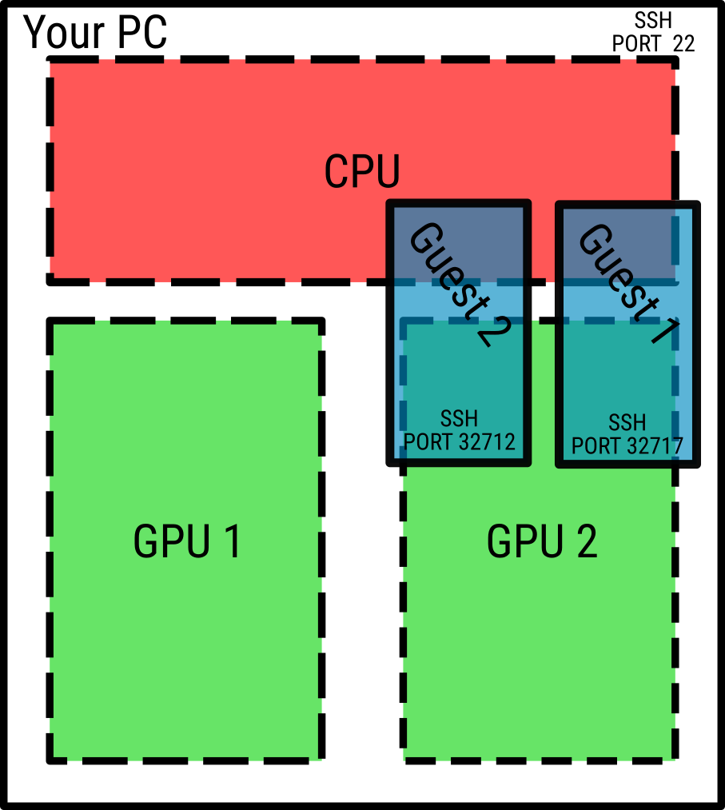

# Persistent Guest Container Tool


<p align="center">
  
</p>

This tool allows you to create a persistent guest container on a server: you can
create a (docker) container for a temporary user that can be accessed via SSH on
a random or selected port.

This basic tool allows you to give others access to your computational resources
inside an isolated container, without access to your server or other containers.

# Quickstart

On the server
```bash
$ python3 guest_container_tool.py --help
$ python3 guest_container_tool.py -u rdyro -k "$(cat ~/.ssh/id_rsa.pub)" -c ubuntu -p 2222
$ ssh -p 2222 rdyro@localhost # you're now in the container
```

# Setup

## `docker` setup

Make sure your user account can use `docker` without sudo, in the `docker` group:

```bash
$ sudo usermod -aG docker $USER
$ # Log out and log back in or run
$ newgrp docker
```

## Help and usage

```bash
usage: guest_container_tool.py [-h] [-u USERNAME] [-p PORT] [-k PUBLIC_KEY_STR]
                               [-c CONTAINER_IMAGE] [-g GPUS] [-n]
                               [-H REVERSE_PROXY_HOST] [--config CONFIG]
                               [--extra-docker-run-args EXTRA_DOCKER_RUN_ARGS]

options:
  -h, --help            show this help message and exit
  -u USERNAME, --username USERNAME
                        username
  -p PORT, --port PORT  port
  -k PUBLIC_KEY_STR, --public-key-str PUBLIC_KEY_STR
                        Public RSA key as a string
  -c CONTAINER_IMAGE, --container-image CONTAINER_IMAGE
                        Container image name (e.g., from docker hub
                        `ubuntu:latest`)
  -g GPUS, --gpus GPUS  Whether and what GPUs to pass to docker
  -n, --dry-run         Dry run, do not run the container.
  -H REVERSE_PROXY_HOST, --reverse-proxy-host REVERSE_PROXY_HOST
                        (Optionally) Host to use for reverse proxy. If
                        complicated, use ~/.ssh/config to set up a host alias.
  --config CONFIG       Path to a JSON config file as an alternative to command
                        line arguments.
  --extra-docker-run-args EXTRA_DOCKER_RUN_ARGS
                        Extra arguments to pass to docker run -- when creating the
                        persistent container.
```

## Using a JSON config file instead

Instead of using the command line arguments, you can also make a simple JSON
file that mirrors the command line arguments.

`example_config.json`:
```
{
  "username": "rdyro",
  "public_key_str": "ssh-rsa ...",
  "container_name": "ubuntu"
}

```
